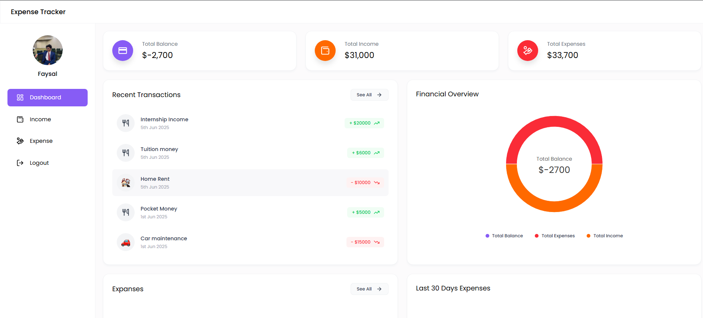
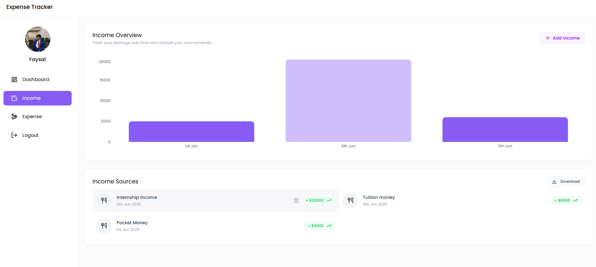
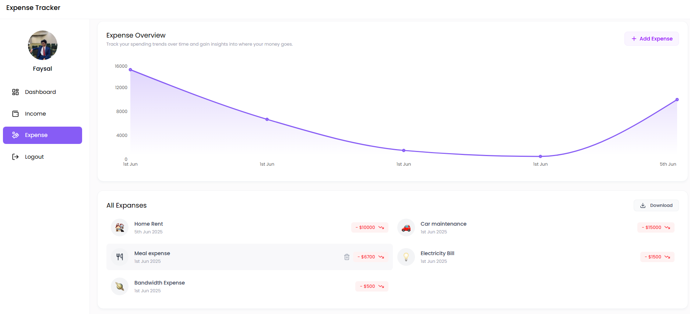

# 💸 Expense Tracker App (MERN Stack)

A **Full Stack Expense Tracker Application** built using the **MERN** stack (**MongoDB, Express.js, React.js, Node.js**). This application enables users to manage their **income and expenses** efficiently with features like interactive charts, secure authentication, Excel report downloads, and a responsive UI.

---

# **📸 Screenshots**

## **Dashboard Overview**


## **Income Management**


## **Expense Report**


## ✨ Features

- 🔐 **JWT Authentication** – Secure login and registration.
- 📊 **Dashboard Summary** – Total Balance, Income & Expenses in summary cards.
- 💰 **Income Tracker** – Add, view, delete, and export incomes.
- 💸 **Expense Tracker** – Add, view, delete, and export expenses by category.
- 📈 **Interactive Charts** – Bar, Pie, and Line charts for income/expense.
- 🕒 **Recent Transactions** – Displays latest incomes and expenses.
- 📤 **Excel Export** – Download complete data in `.xlsx` format.
- 📱 **Responsive UI** – Mobile, tablet, and desktop-friendly interface.
- 🧭 **Easy Navigation** – Sidebar with links to Dashboard, Income, Expenses, and Logout.
- 🗑️ **Quick Delete** – Hover to delete income/expense cards.

---
# 🛠️ **Installation**

### **1️⃣ Clone the Repository**
```sh
git clone https://github.com/faysalcsecu/Web-Engg.git
cd Web-Engg
```
### **2️⃣ Navigate to Backend & Install Dependencies**
```sh
cd backend
npm install
```
### **3️⃣ Navigate to Frontend & Install Dependencies**
```sh
cd ../frontend
npm install
```
### **4️⃣ Start the Application**
```sh
# Start backend server
cd ../backend
npm run dev

# In a new terminal, start frontend
cd ../frontend
npm start
```
# 👤 **Authors**

**Faysal Bin Alauddin**  
📧 Email: faysalf716@gmail.com
🔗 GitHub: [My GitHub Profile](https://github.com/faysalcsecu)  
🔗 LinkedIn: [My LinkedIn Profile](https://www.linkedin.com/in/faysal-bin-alauddin-4815a92a7/)

**Md. Nahin Munkar**  
📧 Email: nahin.cse.cu@gmail.com
🔗 GitHub: [My GitHub Profile](https://github.com/mdnahinmunkar)  
🔗 LinkedIn: [My LinkedIn Profile](https://surl.li/uwbpzr)


**Tasfiqur Rahman Siddique**  
📧 Email: tasfique.csecu21@gmail.com
🔗 GitHub: [My GitHub Profile](https://github.com/TRSiddique)  
🔗 LinkedIn: [My LinkedIn Profile](https://www.linkedin.com/in/tasfiquecsecu/)


